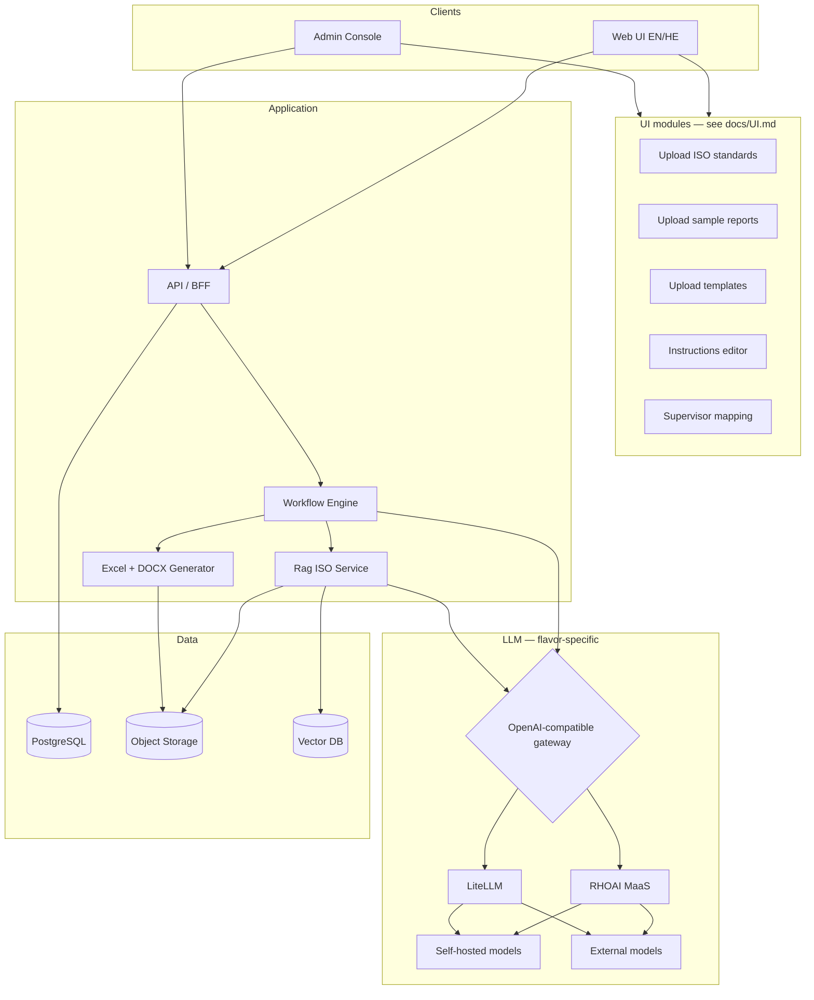

# Architecture

## Design principle: one application, two platform flavors

All application services use an **OpenAI-compatible client** (`base_url` + `api_key` + `model`). Platform teams choose the gateway by deployment flavor:

| Flavor | Gateway | Primary use |
|--------|---------|-------------|
| **openshift-rhoai** | RHOAI **MaaS** `/v1` | Red Hat stack — **first implementation & test** |
| **k8s-litellm** | **LiteLLM** `/v1` | Generic K8s, dev labs, alternate clouds |

No provider-specific SDKs in application code.

## Logical architecture



## Pipeline stages (prompt-administrable)

| Stage | Purpose | LLM |
|-------|---------|-----|
| `context_summarize` | Normalize questionnaire → org profile | Optional |
| `finding_normalize` | Parse Word/Excel/paste → finding records | Yes |
| `iso_map_and_score` | Map finding → ≤3 clauses, ≥50% relevance, severity | Yes |
| `clause_coverage` | N/A vs not checked vs covered | Rules + LLM assist |
| `corrective_action_draft` | Major/critical CA text | Yes |
| `ofi_instruction_draft` | Minor/OFI text | Yes |
| `report_narrative` | DOCX regulatory narrative | Yes |

Prompts stored in DB with version, locale, and audit (admin console).

## Rag ISO

- **Ingest:** ISO standard PDFs/text per edition → chunk by clause ID
- **Index:** embeddings + metadata (`standard`, `edition`, `clause`, `title`)
- **Retrieve:** hybrid search for candidate clauses per finding
- **Governance:** projects lock to an edition; re-index on new release without mutating closed audits

## Supervised learning

1. **MVP:** store supervisor edits as labeled `(finding, clause, severity, relevance)` tuples
2. **Phase 2:** use labels to rerank retrieval or fine-tune a classifier on-cluster

## Model routing (by task)

Configure **model aliases** in the gateway (same alias names in both flavors):

| Alias | Typical backend (OpenShift) | Typical backend (K8s/LiteLLM) |
|-------|------------------------------|-------------------------------|
| `iso-mapper` | MaaS → strong reasoning model | LiteLLM → OpenAI/Anthropic route |
| `iso-report` | MaaS → same or dedicated model | LiteLLM route |
| `iso-embed` | MaaS or local embedding service | LiteLLM embedding route |

Sensitive engagements: route **only** to self-hosted models via MaaS/LiteLLM policy; disable external `ExternalModel` routes in production namespaces.

## OpenShift + RHOAI flavor (primary)

Reference pattern (similar to ragu-builder):

```
iso-webui / iso-api  →  iso-openai-gateway (optional passthrough)  →  MaaS /v1  →  LLMInferenceService | ExternalModel
```

**RHOAI 3.4+** features to use:

- **MaaS** OpenAI-compatible endpoint
- **`ExternalModel`** for approved external providers
- **`LLMInferenceService`** / vLLM for on-cluster models
- **MaaSAuthPolicy**, **MaaSSubscription** for tenant quotas

Manifests: `infra/openshift-rhoai/`

## K8s + LiteLLM flavor (maintained)

```
iso-api  →  LiteLLM :4000/v1  →  vLLM on cluster | OpenAI | Azure | …
```

LiteLLM `config.yaml` defines model list mirroring MaaS aliases (`iso-mapper`, etc.) so application env vars stay identical.

Manifests: `infra/k8s-litellm/`

## Configuration contract (both flavors)

Application reads:

```yaml
LLM_GATEWAY_URL: https://<gateway-host>/v1
LLM_API_KEY: <token>
LLM_MODEL_MAPPING: iso-mapper
LLM_MODEL_REPORT: iso-report
LLM_MODEL_EMBED: iso-embed
```

Helm/Kustomize overlays per flavor set these values only — no code forks.

## Core entities (data model sketch)

- `Project`, `CertificationScope`, `ContextQuestionnaire`
- `Finding`, `FindingSourceDocument`
- `IsoStandardEdition`, `IsoClause`
- `FindingClauseMapping` (relevance, severity, status)
- `ClauseCoverageStatus` (compliant | NC | N/A | not_checked)
- `SupervisorReview`, `PromptTemplate`, `GeneratedArtifact`
- `CorpusDocument` — typed: `iso_standard` | `sample_report` | `template` (see [UI.md](UI.md))

## User interface

Screen flows, roles, and MVP priorities: **[docs/UI.md](UI.md)**.

## Security & compliance

- Tenant isolation, encryption at rest, audit log immutability
- External LLM routes require explicit project flag (data residency)
- Export watermark + hash for generated DOCX/XLSX

## Phase 1 MVP scope

- Single standard (**ISO 9001**) end-to-end on **openshift-rhoai**
- Parallel **k8s-litellm** manifests smoke-tested with same API contract
- Hebrew DOCX/XLSX templates for Result 2 & 3
