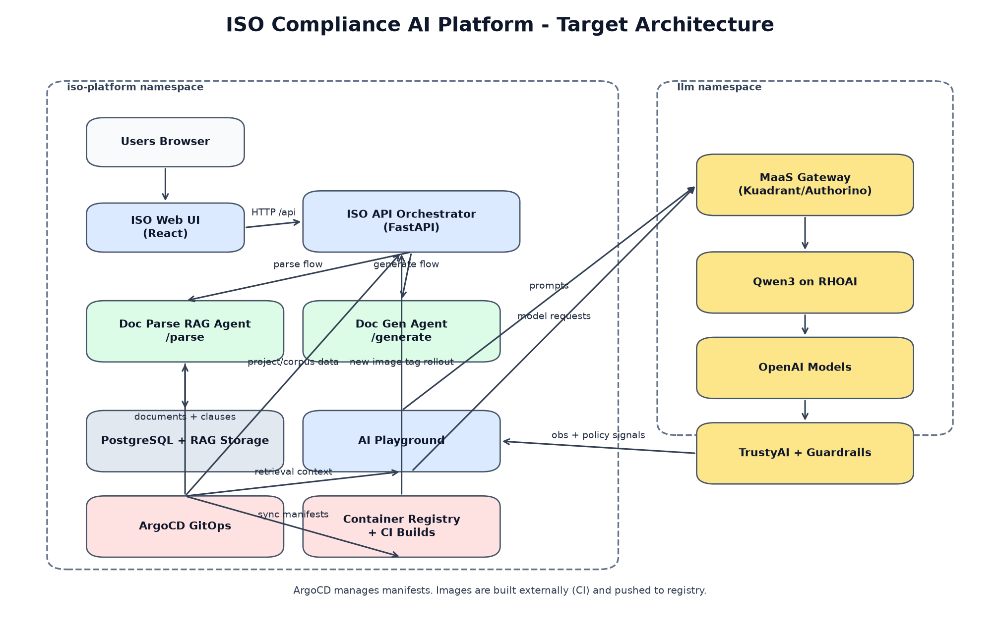

# Demo Flow

### Act 1 — Platform Overview (5 min)

**Goal**: Show the value proposition before touching any UI.

> "This platform does three things:
> 1. Runs AI models **on-premises** — your data never leaves your cluster
> 2. Provides **AI guardrails and observability** via TrustyAI — so you can trust what the AI says
> 3. Connects AI to your **ISO compliance work** — documents, clauses, audit findings"

Show the architecture diagram:


---

### Act 2 — RHOAI Dashboard (5 min)

**URL**: `https://rhods-dashboard-redhat-ods-applications.apps.ocp.7hrxw.sandbox880.opentlc.com`

1. **Log in** with your OpenShift credentials.

2. **Projects** → Click **llm**
   - Show the `qwen3-4b-instruct` LLMInferenceService
   - Click **Try** → launches built-in RHOAI chat playground
   - _"This is the model running on your own GPU — air-gapped if needed."_

3. **Trusty AI** tab
   - Show `trustyai` service: `Status: UP · Liveness: UP · Data store: UP`
   - _"Every inference is logged here. We can detect drift, measure fairness, audit what the model said."_

4. **Model Serving** → show the MaaS endpoint URL
   - _"Any application can call this via the OpenAI-compatible API."_

**Key message**: _"RHOAI gives you a managed AI platform — models, observability, access control — all in one place."_

---

### Act 3 — AI Playground (10 min)

**URL**: `https://playground-iso-platform.apps.ocp.7hrxw.sandbox880.opentlc.com`

#### 3.1 Architecture callout (sidebar)
Point to the right sidebar:
- **TrustyAI: UP** — live status from the cluster
- **Model list**: Qwen3 (RHOAI) + GPT-4o variants
- **Guardrails: active** — topic filter + TrustyAI logging

#### 3.2 Try the local model
- Select **Qwen3 4B Instruct 2507 — RHOAI MaaS**
- Badge shows **RHOAI** (blue)
- Note in info bar: _"4B params · 131k context · L40 GPU"_

Ask:
> _"What is ISO 27001 and how does it relate to OpenShift AI?"_

**Show response**:
- Response streamed from the on-prem GPU
- "Model: qwen3-4b-instruct · 3.2s · 420 tokens"
- _"This ran entirely on your infrastructure."_

#### 3.3 Topic guardrails demo
Ask something off-topic:
> _"What is the weather in Tel Aviv?"_

**Show blocked response**:
- Yellow blocked banner: `🚫 Blocked by guardrails`
- _"The guardrails enforce that this assistant only answers questions in scope."_

#### 3.4 Switch to OpenAI
- Select **GPT-4o — OpenAI**
- Badge switches to **openai** (green)
- Ask same ISO question

**Compare**:
- Both models answer correctly
- One runs on-prem (Qwen3), one in cloud (GPT-4o)
- _"You choose which model to use per use case — cost, latency, data residency."_

---

### Act 4 — Document Upload & RAG (5 min)

**URL**: `https://iso-web-iso-platform.apps.ocp.7hrxw.sandbox880.opentlc.com/admin/knowledge/iso`

1. **Upload a PDF** (use one of `RAG/RAG-Standards/*.docx` as example)
   - Select standard: ISO9001
   - Language: English
   - Check **Replace existing**
   - Upload

2. Watch the upload response:
   - `parse_method: llm` — extracted via `iso-doc-parse-rag` and MaaS-routed model
   - `clauses_imported: XX`
   - `validation: {rag_hit_rate: 0.95, passed: true}`
   - _"The AI read the PDF and structured it into searchable clauses — validated automatically."_

3. **Switch to Documents tab**
   - Show the stored original file
   - Click download to prove the original is preserved
   - Show validation badge (green checkmark + RAG coverage %)

---

### Act 5 — ISO Viewer (5 min)

**URL**: `https://iso-web-iso-platform.apps.ocp.7hrxw.sandbox880.opentlc.com/iso`

1. Select **ISO9001** · Language **English**
2. Click a clause (e.g., **4.1 Understanding the organization**)
3. Switch to **Hebrew** — show bilingual support
4. _"Compliance teams can read and review every clause in their language."_

---

### Act 6 — TrustyAI Deep Dive (5 min, optional for technical audience)

Back in RHOAI Dashboard → Project llm → Trusty AI:

1. **Inference logging**:
   - _"Every call to the playground was logged here — who asked, what, when"_

2. **Guardrails Orchestrator**:
   - Show `qwen3-guardrails` deployed
   - _"We use the fms-guardrails-orchestr8r with HAP (hate/abuse/profanity) detector"_
   - _"In production this runs inline — blocked content never reaches the model"_

3. **Drift detection** (roadmap):
   - _"As you serve more requests, TrustyAI alerts if the model's behavior changes"_

---

### Act 7 — GitOps & Configuration (3 min)

Open ArgoCD: `https://openshift-gitops-server-openshift-gitops.apps.ocp.7hrxw.sandbox880.opentlc.com`

Show:
- `iso-compliance-platform` + `llm-ai-platform`: **Synced · Healthy**
- Source: `gitops/overlays/ocp-sandbox3159/llm-ai/`
- Resources: TrustyAI, GuardrailsOrchestrator, RBAC, namespace labels

> _"Everything is Git-managed. To add a new model, you add one JSON object to a ConfigMap and push — the playground picks it up automatically."_

Show `playground-models-config.yaml`:
```yaml
MODELS_CONFIG: |
  [
    {"id":"qwen3-4b-instruct","label":"Qwen3 4B...","provider":"rhoai",...},
    {"id":"gpt-4o","label":"GPT-4o...","provider":"openai",...}
  ]
```

---

## Two-Flavor Architecture Callout

**Red Hat OpenShift stack** (shown today):
- OpenShift AI with MaaS gateway (Kuadrant + Authorino)
- TrustyAI + GuardrailsOrchestrator
- ArgoCD for GitOps

**Pure Kubernetes / open-source** (available for non-RH environments):
- Kubernetes + Nginx Ingress
- Ollama for on-prem model serving
- Same application code, different deployment manifests

> _"Same app, same GitOps repo, two `deploy/` directories."_

---

## Q&A Preparation

| Question | Answer |
|----------|--------|
| "Can we use our own models?" | Yes — add an entry to `MODELS_CONFIG` pointing to any OpenAI-compatible endpoint |
| "Is data logged?" | Inference requests are logged to TrustyAI. No data leaves the cluster for on-prem models |
| "What about Hebrew / other languages?" | Bilingual EN/HE viewer + LLM-powered translation built in |
| "How do we add more ISO standards?" | Upload PDF via Admin UI → AI parses and indexes automatically |
| "Can we restrict which users access which models?" | Yes — Kuadrant MaaS tiers: free/premium/enterprise, mapped to OpenShift groups |

---

## URLs Reference Card

| Service | URL |
|---------|-----|
| AI Playground (unified) | https://playground-iso-platform.apps.ocp.7hrxw.sandbox880.opentlc.com |
| ISO Compliance Platform | https://iso-web-iso-platform.apps.ocp.7hrxw.sandbox880.opentlc.com |
| RHOAI Dashboard | https://rhods-dashboard-redhat-ods-applications.apps.ocp.7hrxw.sandbox880.opentlc.com |
| ArgoCD | https://openshift-gitops-server-openshift-gitops.apps.ocp.7hrxw.sandbox880.opentlc.com |
| MaaS API | https://maas.apps.ocp.7hrxw.sandbox880.opentlc.com |
| Qwen3 4B endpoint | https://maas.apps.ocp.7hrxw.sandbox880.opentlc.com/llm/qwen3-4b-instruct/v1 |
