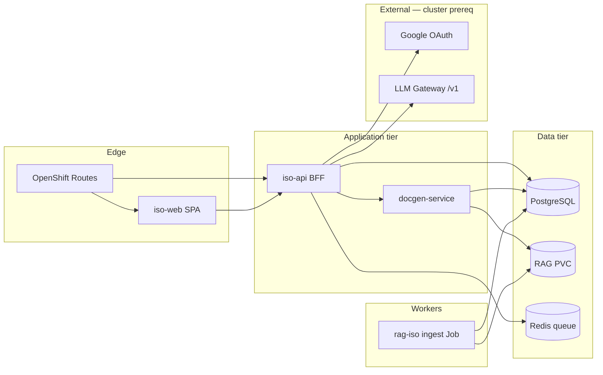

# Microservices — ISO Compliance Platform

Deployable components (OpenShift namespace `iso-platform`). Application code is **flavor-agnostic**; only gateway URLs differ per `openshift-rhoai` vs `k8s-litellm`.

## Service map



| Service | Image | Responsibility |
|---------|-------|----------------|
| **iso-web** | `iso-platform/iso-web` | React SPA: projects, admin, supervisor mapping, **bilingual ISO viewer (EN/HE, LTR/RTL)**, Google sign-in |
| **iso-api** | `iso-platform/iso-api` | BFF: OAuth/JWT, users/RBAC, projects, findings, mapping, corpus admin, instructions, export triggers |
| **docgen-service** | `iso-platform/docgen` | Excel/DOCX generation (Hebrew RTL), template merge |
| **rag-iso** | `iso-platform/rag-iso` | Batch ingest from `RAG/` manifest; clause chunk index |

## iso-api modules (single deployable, modular routes)

| Module | Prefix | Functions |
|--------|--------|-----------|
| `auth` | `/auth` | Google OAuth, JWT session, dev login (dry-run) |
| `users` | `/admin/users` | List/invite/deactivate users (admin) |
| `projects` | `/v1/projects` | CRUD, context questionnaire |
| `findings` | `/v1/projects/{id}/findings` | Upload, parse, manual entry |
| `mapping` | `/v1/projects/{id}/mapping` | LLM proposals, supervisor edit, approve |
| `coverage` | `/v1/projects/{id}/coverage` | Clause matrix N/A / not checked |
| `corpus` | `/admin/corpus` | ISO / samples / templates metadata + reindex |
| `iso_text` | `/v1/iso` | **Clause search & bilingual text viewer** |
| `instructions` | `/admin/instructions` | Versioned prompt templates |
| `exports` | `/v1/projects/{id}/exports` | Trigger docgen, download artifacts |

## Authentication

- **Production:** Google OAuth 2.0 (`GOOGLE_CLIENT_ID`, `GOOGLE_CLIENT_SECRET`).
- **Bootstrap admins:** `yaakovpreiger@gmail.com`, `valeria.preiger@gmail.com` — always `admin` role on first login.
- **User invite:** Admin adds email + roles; user must sign in with matching Google account.
- **Dry-run:** `AUTH_DEV_MODE=1` enables `POST /auth/dev-login` (local/CI only).

## Roles

| Role | API claim | UI access |
|------|-----------|-----------|
| `admin` | `admin` | Knowledge, instructions, users, settings |
| `consultant` | `consultant` | Projects, findings, read mapping |
| `supervisor` | `supervisor` | Mapping review, approve, coverage |

## UI routes (iso-web)

| Route | Screen |
|-------|--------|
| `/login` | Google sign-in |
| `/projects` | Project dashboard |
| `/projects/:id/context` | Context questionnaire |
| `/projects/:id/findings` | Findings ingest |
| `/projects/:id/mapping` | Supervisor three-pane mapping |
| `/projects/:id/coverage` | Clause matrix |
| `/projects/:id/exports` | Excel/DOCX export |
| `/iso` | **ISO text viewer (language toggle EN/HE, RTL/LTR)** |
| `/admin/knowledge/iso` | ISO corpus admin |
| `/admin/knowledge/samples` | Sample reports |
| `/admin/knowledge/templates` | Templates |
| `/admin/instructions` | Prompt editor |
| `/admin/users` | **User management** |
| `/admin/settings` | System settings |

## Environment contract

See `gitops/layers/02-app-infra/configmap-app.yaml`. Key additions:

| Variable | Service | Purpose |
|----------|---------|---------|
| `GOOGLE_CLIENT_ID` | iso-api | OAuth |
| `GOOGLE_CLIENT_SECRET` | iso-api | OAuth (Secret) |
| `JWT_SECRET` | iso-api | Session signing (Secret) |
| `AUTH_DEV_MODE` | iso-api | `1` for dry-run dev login |
| `ADMIN_EMAILS` | iso-api | Comma-separated bootstrap admins |
| `ISO_WEB_URL` | iso-api | OAuth redirect base |

## Dry-run (no OpenShift)

```bash
./scripts/dry-run-local.sh
```

Starts Postgres, runs migrations, pytest, builds iso-web, hits API health + auth smoke tests.

## Phase 2 (not blocking MVP deploy)

- Real PDF/DOCX parsing in rag-iso
- Vector embeddings + hybrid search
- LLM pipeline wiring to MaaS
- Keycloak option replacing direct Google OAuth
