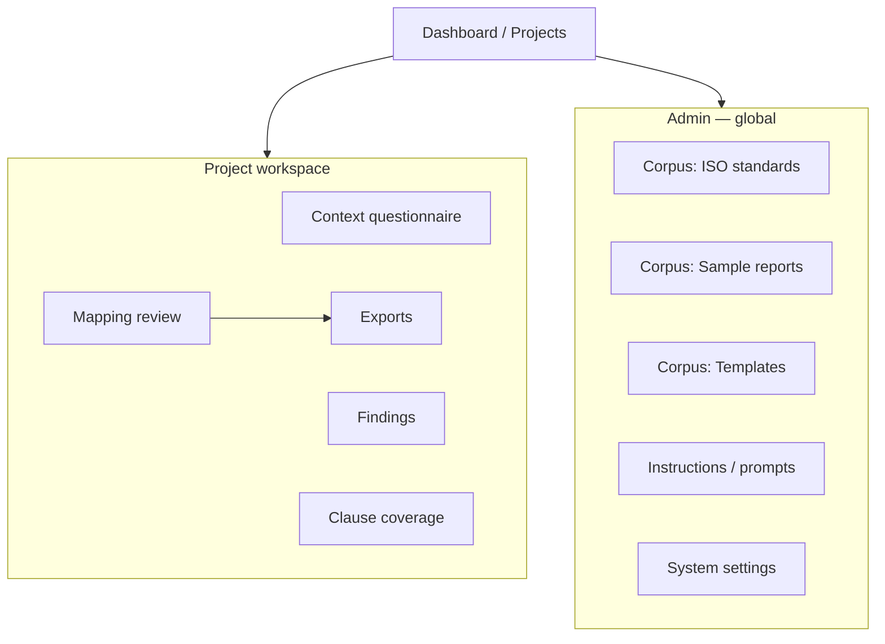

# User interface plan

Web application for consultants, supervisors, and administrators. **UI language: English.** Generated **samples and templates: Hebrew (RTL)**.

## Roles

| Role | Primary tasks |
|------|----------------|
| **Admin** | Corpus uploads (ISO / samples / templates), instruction prompts, users, model aliases |
| **Consultant** | Context questionnaire, findings ingest, run mapping, request supervisor review, export |
| **Supervisor** | Review/edit finding ↔ clause mappings, approve exports |

A user may hold multiple roles. RBAC enforced per project.

## Information architecture



### Top navigation (authenticated)

| Item | Audience | Route (example) |
|------|----------|-----------------|
| **Projects** | All | `/projects` |
| **Knowledge** | Admin | `/admin/knowledge` |
| **Instructions** | Admin | `/admin/instructions` |
| **Settings** | Admin | `/admin/settings` |

Within a **project**: Context → Findings → Mapping → Coverage → Exports (stepper or left nav).

---

## 1. Upload — ISO standards RAG

**Purpose:** Ingest official standard text for retrieval (Rag ISO). Versioned by standard + edition.

### Screen: Admin → Knowledge → **ISO standards**

| UI element | Behavior |
|------------|----------|
| **Standard selector** | ISO 9001 / 14001 / 45001 / 13485 (multi-select for bulk upload) |
| **Edition / year** | Required (e.g. `2015`, `2016`, `2018`) — immutable after index |
| **Language of source** | EN (primary); HE optional if licensed translation uploaded |
| **Upload zone** | Drag-drop **PDF, DOCX, TXT**; multi-file; max size shown |
| **Clause detection** | Option: auto-detect clause numbering vs manual mapping file (CSV: `clause_id, title, page_start`) |
| **Processing status** | Queued → parsing → chunking → embedding → **Ready** / **Failed** (log link) |
| **Corpus table** | Columns: Standard, Edition, Files, Chunks, Last indexed, Status, Actions |
| **Actions** | Re-index, Deactivate (soft), Download source (admin), View sample chunks |
| **Preview drawer** | Click chunk: clause ID, text snippet, embedding model version |

### Validation & rules

- Cannot delete edition referenced by an **active project** (deactivate only).
- Re-index creates new index version; projects pin to index at creation.
- Warn if duplicate edition uploaded.

### API / backend (for implementers)

- `POST /admin/corpus/iso/upload`
- `POST /admin/corpus/iso/{editionId}/reindex`
- `GET /admin/corpus/iso`

---

## 2. Upload — Sample reports RAG

**Purpose:** Historical audit reports for **supervised learning** and few-shot context (not customer-facing output).

### Screen: Admin → Knowledge → **Sample reports**

| UI element | Behavior |
|------------|----------|
| **Upload zone** | PDF, DOCX, XLSX (reports with past finding mappings) |
| **Metadata form** | Standard(s), industry, org size band, language (EN/HE), **anonymized** checkbox (required attestation) |
| **Tags** | Optional: `major-nc`, `combined-9001-14001`, etc. |
| **Processing** | Extract findings + mappings if structured; else text chunks for RAG |
| **Corpus table** | Report name, Standards, Indexed, Used in N projects, Status |
| **Privacy banner** | “Do not upload client-identifiable data without consent.” |

### Supervisor-linked learning

When supervisor confirms/edits mappings on a live project, offer:

- **“Add to sample library”** (supervisor + admin) — exports anonymized mapping pairs into sample corpus.

---

## 3. Upload — Templates RAG

**Purpose:** Hebrew **Excel** and **DOCX** templates for Result 2 & 3; optional prompt snippets for report sections.

### Screen: Admin → Knowledge → **Templates**

| UI element | Behavior |
|------------|----------|
| **Template type** | Excel mapping export / DOCX regulatory report / Combined multi-standard report |
| **Standard scope** | Single or combined (e.g. 9001+14001) |
| **Language** | **Hebrew (default)**; EN preview optional |
| **Upload** | `.xlsx`, `.docx` with **placeholder markers** (e.g. `{{finding_text}}`, `{{clause_ref}}`) |
| **Placeholder validator** | On upload, scan required placeholders; show missing list |
| **Preview** | Render with dummy data (RTL for DOCX) |
| **Version history** | v1, v2…; projects pin template version at export time |
| **RAG index** | Template **instruction blocks** ( Hebrew guidance paragraphs ) indexed for LLM context during generation |

### Template table

| Name | Type | Standard | Version | Status | Actions |
|------|------|----------|---------|--------|---------|

---

## 4. Instructions edit (prompt admin)

**Purpose:** Versioned **prompts per pipeline stage** (see `docs/ARCHITECTURE.md`). No redeploy to change wording.

### Screen: Admin → **Instructions**

| UI element | Behavior |
|------------|----------|
| **Stage tabs** | `context_summarize`, `finding_normalize`, `iso_map_and_score`, `clause_coverage`, `corrective_action_draft`, `ofi_instruction_draft`, `report_narrative` |
| **Editor** | Markdown or plain text; variable chips: `{{org_profile}}`, `{{finding}}`, `{{clause_text}}`, `{{standard}}`, `{{locale}}` |
| **Model alias override** | Optional per stage (default from env) |
| **Parameters** | Temperature, max tokens (advanced collapsible) |
| **Locale** | EN (system prompts); HE notes for generation stages |
| **Version control** | Save draft → Publish; history diff; rollback |
| **Test panel** | Paste sample finding → run stage only → see raw LLM output (admin) |
| **Audit** | Who published, when |

### Safety

- Published prompt immutable; new version required for changes.
- Projects record `prompt_set_version` at mapping run time.

---

## 5. Supervisor edit — Finding → clause mapping

**Purpose:** Human-in-the-loop review of **Result 1** before Excel/DOCX export.

### Screen: Project → **Mapping review** (Supervisor + Consultant read-only until approved)

#### Layout: three-pane (desktop)

```
┌─────────────────┬──────────────────────────┬─────────────────────┐
│ Findings list   │ Finding detail + pairs   │ ISO clause preview  │
│ (filter/status) │ (editable)               │ (RAG snippet)       │
└─────────────────┴──────────────────────────┴─────────────────────┘
```

#### Left — Findings list

- Filters: unreviewed / reviewed / flagged
- Badge: count of proposed pairs
- Sort by severity max, ID

#### Center — Finding detail

| Field | Editable |
|-------|----------|
| Finding text | Read-only (link to edit in Findings step) |
| Proposed pairs (≤3) | **Supervisor** |
| Relevance % | Show; remove pair if &lt;50% or supervisor override |
| Severity per pair | Dropdown: Minor (OFI) / Major / Critical |
| Actions | **Remove pair**, **Add pair** (search clause), **Approve finding** |

**Add pair flow:** Search box → Rag ISO search by clause ID or keyword → pick clause → set severity → relevance from retrieval score.

#### Right — Clause preview

- Standard + clause ID + title + retrieved text
- Link “Open in standard corpus” (admin)

#### Bulk / coverage panel (below or tab)

| View | Purpose |
|------|---------|
| **Clause matrix** | All clauses for selected standard(s): Compliant / NC / **N/A** / **Not checked** |
| **Set N/A** | Supervisor marks clause out of context (reason optional) |
| **Set not checked** | No finding mapped; explicit sign-off |

#### Workflow actions

| Button | Effect |
|--------|--------|
| **Save draft** | Persist supervisor edits |
| **Submit for approval** | Consultant notified |
| **Approve mapping** (supervisor) | Locks mapping; enables export |
| **Request re-run** | Re-invoke LLM mapping for selected findings (audit logged) |

#### Combined certification

- Toggle **Combined report (2 standards)** → matrix shows both standards; export uses combined template.

---

## Supporting screens (MVP)

### Context questionnaire (Input 1)

- Wizard: org info → departments/processes → certification type(s)
- Save draft; drives N/A suggestions in mapping

### Findings (Input 2)

- Tabs: Upload Word / Upload Excel / Paste table / Manual entry
- Parse preview before commit
- Normalize to finding records

### Exports (Result 2 & 3)

- Select template version (Hebrew)
- Generate **Excel** / **DOCX** — disabled until mapping **Approved**
- Download + hash + timestamp in audit log

### Project dashboard

- Progress: Context ✓ → Findings ✓ → Mapping (in review) → Export
- Assigned supervisor, standard(s), edition lock

---

## UI technology (recommendation)

| Layer | Choice | Notes |
|-------|--------|-------|
| Framework | **React** + **PatternFly** | Fits OpenShift / enterprise; good tables & wizards |
| i18n | **react-i18next** | EN UI; HE for template preview labels |
| RTL | CSS logical properties | DOCX RTL is server-side; preview iframe RTL |
| Auth | Keycloak (OpenShift) | Roles: `iso-admin`, `iso-consultant`, `iso-supervisor` |
| File upload | Presigned S3 / ODF | Progress bar; virus scan hook (Phase 2) |

App location in repo: `apps/iso-web/`

---

## MVP screen priority

| Priority | Screen |
|----------|--------|
| P0 | Project list, Context, Findings upload |
| P0 | **Supervisor mapping** (three-pane) |
| P0 | Admin **ISO standards** upload |
| P1 | Admin **Instructions** editor |
| P1 | Admin **Templates** upload + validator |
| P1 | Exports |
| P2 | Admin **Sample reports** upload |
| P2 | Clause matrix / combined report |

---

## Accessibility & audit

- Keyboard navigation for mapping table (supervisor efficiency)
- All supervisor changes: `user_id`, `timestamp`, `before`/`after` JSON
- Export watermark: project ID, approval user, prompt version

See also: [PRD.md](PRD.md), [ARCHITECTURE.md](ARCHITECTURE.md).
