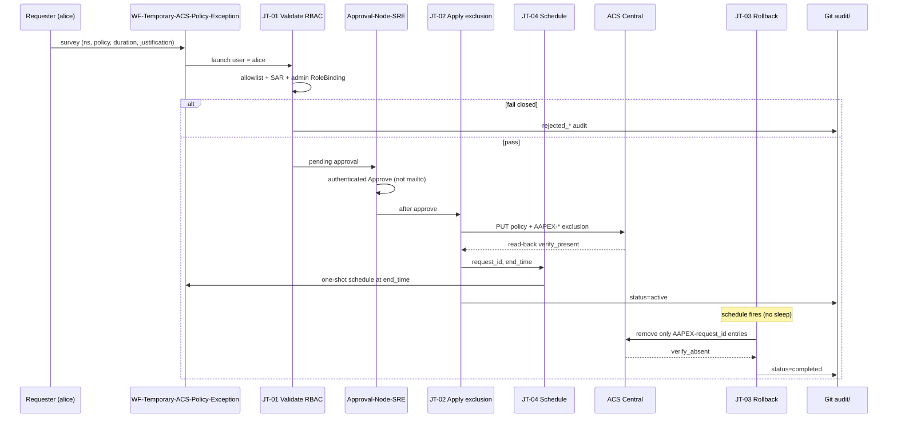

# Architecture — Temporary ACS policy exceptions via AAP

Request-tagged **exclusions** are the only ACS mutation. Policies are never disabled or deleted. Rollback is authoritative (scheduled job + 5-minute reconciler), not ACS `expiration`.

| Component | Role |
|---|---|
| AAP workflow + survey | Self-service form (UC-1). Convenience only. |
| JT-01 | Authoritative namespace-admin RBAC (UC-2, UC-3). Fail closed. |
| Approval-Node-SRE | Authenticated, RBAC-scoped, timestamped approval (UC-6). |
| `roles/acs_exception` | GET/append/remove/verify exclusion (UC-7). |
| JT-04 schedule + JT-03 | Automatic rollback without long-running sleep (UC-8). |
| JT-06 | Safety net every 5 minutes (UC-8b / AC-08). |
| JT-05 + `audit/` | Immutable Git audit trail (UC-9). |
| Allowlist `vars/policy_allowlist.yml` | No free policy selection (UC-12). |

## Design choices vs platform limits

1. **Survey refresh + server-side validation (UC-1/2/3).** AAP surveys cannot query per-user RBAC. JT-00 refreshes namespace choices hourly; JT-01 re-validates allowlist, duration, justification, and admin RoleBinding + SubjectAccessReview. The form is convenience; the workflow is the control.
2. **In-AAP approval (UC-6).** There is no anonymous email-link approve. Notifications include a deep link to `{AAP_URL}/#/workflow_approvals`. Every approval is authenticated, RBAC-scoped to `SRE-Approvers`, and timestamped — stronger than a mailto link.
3. **Schedule + reconciler instead of sleep (UC-8).** Customer guidance forbids a long-running sleep job. JT-04 creates a one-shot Controller schedule at `end_time`; JT-06 reconciles expired `active` audit records and orphan `AAPEX-*` exclusions if AAP was down.
